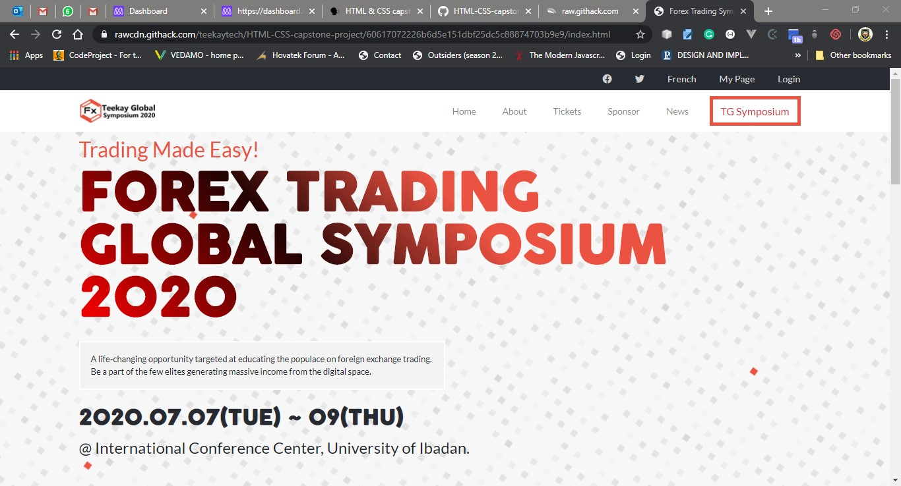
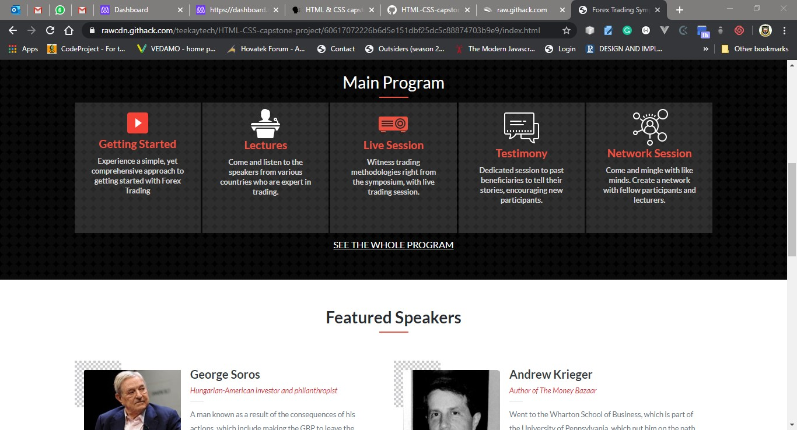

# HTML CAPSTONE PROJECT (Forex Trading Symposium Website)

This is a capstone project that focuses on developing a website for an upcoming forex trading symposium.
   
  

The aim of this project is to develop a real-world-like project based on an online website for an upcoming symposium. The contents are personalized and the design specifications were obtained [here](https://www.behance.net/gallery/29845175/CC-Global-Summit-2015).

## Built with
  * HTML 
  * CSS (Bootstrap)
  * Linter (Stickler)
  * W3C Validator

## Live demo
[Live Demo Link](https://rawcdn.githack.com/teekaytech/HTML-CSS-capstone-project/b16bad436643710aa599642abbcad6a4af92a107/index.html)

## Getting started
**I created a website a forex trading company (assumed by me). The design specifications were gotten from [Cindy Shin in Behance](https://www.behance.net/adagio07). The project consist of three(3) working pages (including home, about and tickets pages) with each page having versions for 2 different screen sizes (mobile and desktop)**

## Authors
 :bust_in_silhouette: **Author:**
 * Name: Taofeek OLALERE
 * Github: https://github.com/teekaytech/
 * Twitter: https://twitter.com/ola_lere
 * LinkedIn: https://www.linkedin.com/in/teekaytech/

## Contributing
Contributions, issues and feature requests are welcome!

   1. Fork the Project
   2. Create your Feature Branch (git checkout -b feature/AmazingFeature)
   3. Commit your Changes (git commit -m 'Add some AmazingFeature')
   4. Push to the Branch (git push origin feature/AmazingFeature)
   5. Open a Pull Request

Feel free to check the [issues page](https://github.com/teekaytech/HTML-CSS-capstone-project/issues).

## Show your support
Give a :star: if you like this project!

## Acknowledgements
  * [Microverse](https://www.microverse.org/)
  * [The Odin Project](https://www.theodinproject.com/courses/html5-and-css3/lessons/embedding-images-and-video#introduction)
  * [Cindy Shin in Behance](https://www.behance.net/gallery/29845175/CC-Global-Summit-2015)
  * [FXTM](https://www.forextimeir.com/education/forex-seminars)
  * [Forex News Now](https://www.forexnewsnow.com/education/forex-basics/top-10-most-successful-forex-traders-in-the-world/)

## License
 Distributed under the MIT License.
